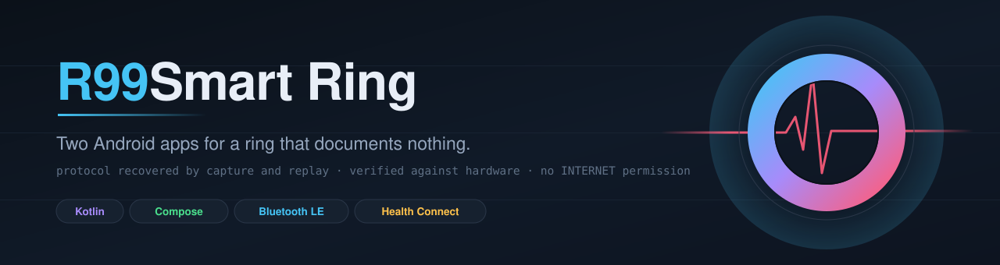
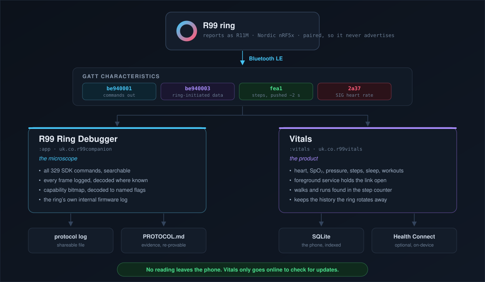
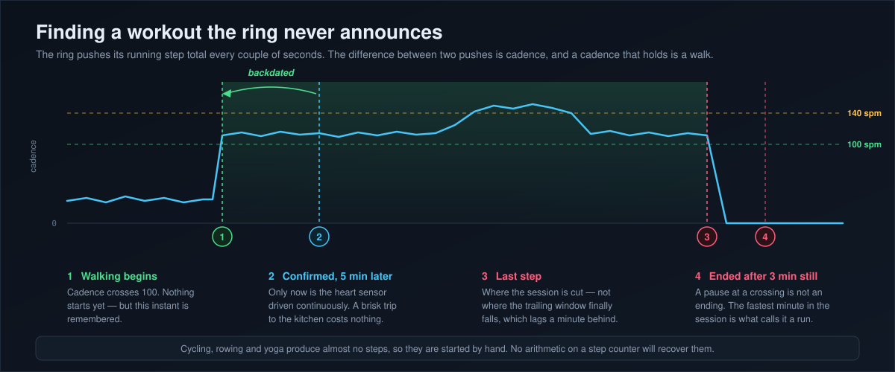
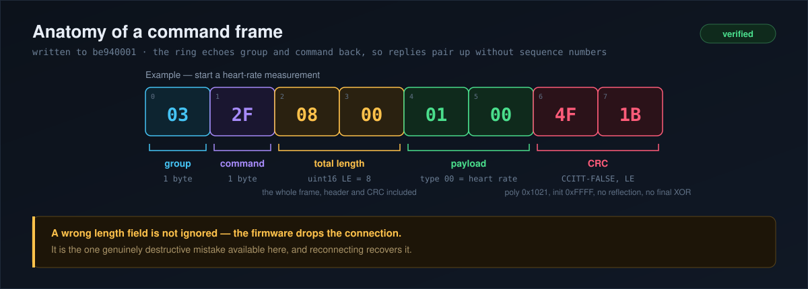

<div align="center">



<p>
  
  
  
  
  
  
</p>

<p>
  <b><a href="#the-two-apps">The two apps</a></b> &nbsp;·&nbsp;
  <b><a href="#finding-a-workout-nobody-started">Workouts</a></b> &nbsp;·&nbsp;
  <b><a href="#the-protocol">The protocol</a></b> &nbsp;·&nbsp;
  <b><a href="#build-it">Build</a></b> &nbsp;·&nbsp;
  <b><a href="PROTOCOL.md">PROTOCOL.md</a></b> &nbsp;·&nbsp;
  <b><a href="COMMANDS.md">COMMANDS.md</a></b>
</p>

</div>

---

Two Android apps for the generic **R99** health ring, which reports itself internally as
**R11M**. One takes the ring apart; the other wears it. They install side by side, and neither
has any network access at all.

The protocol was recovered by capture and replay rather than documentation — the vendor app
(`com.zhuoting.healthyucheng`) through an Android HCI snoop log, then every frame replayed from
our own code until the ring behaved. See **[PROTOCOL.md](PROTOCOL.md)** for the wire format and
what has been verified against hardware, and **[COMMANDS.md](COMMANDS.md)** for the vendor SDK's
full 329-command table.

<div align="center">

</div>

## The two apps

|  | **R99 Ring Debugger** (`:app`) | **Vitals** (`:vitals`) |
|---|---|---|
| Package | `uk.co.r99companion` | `uk.co.r99vitals` |
| For | working out what the ring does | using what it does |
| Interface | one scrolling console, XML views | six tabs, Compose and Material 3 |
| Ring commands | all 329, searchable | the handful a health app needs |
| Runs when closed | no | yes, a foreground service holds the link |
| Keeps history | a frame log, shareable as a file | readings and workouts, on the phone |
| Health Connect | no | writes heart rate, SpO₂, blood pressure, steps |
| Finds the ring | scan, or a hardcoded address | pick once, then remembered |

The short version: **the debugger is the microscope, Vitals is the product.** Everything Vitals
does confidently, the debugger proved first.

### 🔬 R99 Ring Debugger — the protocol console

A debugging tool, not a health app. It exists to drive the ring directly, read what it will tell
you, and show the wire traffic while it happens.

- connects straight to a paired ring by address, since a paired ring stops advertising;
- shows link state, firmware version, battery, and live sensor values as they arrive;
- triggers heart rate, blood oxygen and blood pressure measurements on demand;
- reads and writes ring settings: automatic monitoring, the clock, step goal, wearer details;
- exposes **all 329 SDK commands**, searchable, with the destructive ones marked and confirmed;
- decodes `GetDeviceSupportFunction` into the vendor SDK's named capability flags, so what the
  firmware actually implements can be read off directly;
- pulls the ring's own internal firmware log, which carries sleep staging, charge cycles and
  power events that no health app surfaces;
- logs every frame, decoded where known and raw where not, to screen and to a file.

Use it when a reading looks wrong, when a new ring revision turns up, or when something in
PROTOCOL.md needs proving again. **Its output is evidence.**

### 💍 Vitals — the everyday app

What you leave installed. It assumes the protocol is known and gets on with recording.

**Today**, then a tab each for heart rate, SpO₂, blood pressure, steps, sleep and workouts. Each
vital tab carries its own chart, statistics and day-by-day history.

- **Steps** are drawn as 24 hourly bars against a clock, and listed hour by hour underneath, each
  hour opening to show the quarter hours inside it.
- **Sleep**: the ring stages its own nights and hands them over only when asked, so the app asks
  on every connection — the night is drawn as a hypnogram, scored out of a hundred against the
  wearer's own bedtime and wake time, and summarised by week and by month.
- **Notifications**: four things ever interrupt anyone, each on its own channel so any of them can
  be silenced from the phone's own settings without touching the others — an optional bedtime
  reminder and a morning sleep report, both off until switched on; a warning when the step count
  has sat still long enough to mean a stopped ring rather than a still wearer; and a note when a
  walk or a run has been found and recorded.
- **Settings** for who is wearing the ring — name, sex, age, height and weight, which the ring
  itself uses to work out distance and calories — plus the step goal and reading interval. Metric
  or imperial, though the ring is always told metric. Light and dark, following the system.
- **A foreground service** keeps the Bluetooth link open so readings arrive while the app is
  closed. The ring measures on its own schedule and pushes results, so the work is staying
  connected, not polling.
- **Every reading is written to an indexed SQLite database** in the app's own storage, because the
  ring's internal store is small and rotates records away as it fills — history cannot depend on
  the ring remembering.
- **Optionally hands readings to Health Connect**, so other apps on the phone can use them.

> [!NOTE]
> Health Connect is on-device inter-process communication, not a network service. Vitals declares
> no `INTERNET` permission at all, which is a stronger guarantee than promising not to use one.

## Finding a workout nobody started

The ring has no notion of an activity beginning. `Health_HistorySport` has answered with zero
records on every capture, from this app and the vendor's alike, and nothing in the capability
bitmap recognises exercise. What the ring *does* do, unprompted, is push its running step total
every couple of seconds for as long as anything is connected.

The difference between two of those pushes is cadence, and a cadence that holds is what a walk
actually is.

<div align="center">

</div>

Confirming a session turns the heart sensor on for as long as the session lasts, which costs the
ring's battery — so the detector is deliberately slow to believe it, and a brisk crossing of the
kitchen is not enough. Once believed, the session is **backdated to when the walking began**
rather than to the late moment the threshold was finally met, or every detected workout would be
five minutes shorter than the one that happened.

While a session runs, the heart sensor is driven continuously rather than every quarter of an
hour, so what is kept is a curve rather than a scattering of points. Anything the step counter
cannot see — cycling, yoga, the weights room — is still started by hand, and either way a session
is stored whole, with its sport, duration and heart curve, rather than averaged into the day.

The logic lives in [`WorkoutDetector.kt`](vitals/src/main/java/uk/co/r99vitals/WorkoutDetector.kt)
and is covered by [`WorkoutDetectorTest.kt`](vitals/src/test/java/uk/co/r99vitals/WorkoutDetectorTest.kt).

## The protocol

Every frame is the same shape, and the ring echoes `group` and `command` back in its reply, so
requests and responses pair up without needing sequence numbers.

<div align="center">

</div>

The CRC is CRC-16/CCITT-FALSE, recovered by brute-forcing the parameter space against 11 captured
frames; the solution was unique and reproduces every captured frame byte for byte.

```python
def crc16(buf):
    reg = 0xFFFF
    for b in buf:
        reg ^= b << 8
        for _ in range(8):
            reg = ((reg << 1) ^ 0x1021) & 0xFFFF if reg & 0x8000 else (reg << 1) & 0xFFFF
    return reg
```

### Three things that cost the most to learn

Each of these makes a working ring look like a broken or empty one, which is why they are worth
stating before anyone else spends a weekend on them.

<table>
<tr><td width="33%" valign="top">

**Ask for a bigger MTU first**

Without `requestMtu`, the history is *invisible*. The default ATT payload is 20 bytes; a day of
stored readings comes back as one 150-byte frame. The ring answers the query — the count arrives,
because the count is small enough — and then the records themselves are simply never delivered. It
reads exactly like a ring that has recorded nothing.

</td><td width="33%" valign="top">

**Automatic readings are stored, never pushed**

The ring says nothing when it measures on its own. Six hours of listening, with monitoring set to
fifteen minutes, produced no live frame outside a measurement the app itself started. The readings
are all there, in the ring's own store, and only come out when asked for. Nobody taps a ring at
03:25 — but the 03:25 reading exists.

</td><td width="33%" valign="top">

**`2a37` is a trap**

The standard SIG heart-rate characteristic re-notifies on the ring's ~90 s housekeeping tick
whether or not anything was measured, repeating the last number it holds — 82 bpm arrived
unchanged eighteen times in twenty-five minutes. Logging every push fills the day with one stale
reading a minute and looks, at a glance, exactly like working automatic sampling.

</td></tr>
</table>

> [!WARNING]
> **A frame whose length field is wrong does not get ignored — the firmware drops the connection.**
> That is the one genuinely destructive mistake available here, and it is recoverable by
> reconnecting.

Full wire format, GATT map, refusal codes, the stored-history and sleep record layouts, and the
ring's own internal log are all in **[PROTOCOL.md](PROTOCOL.md)**. Claims marked *verified* there
were reproduced by sending our own frame and watching the ring behave; anything else is inference
and is labelled as such.

## Build it

Both apps come out of one Gradle build. Either route produces the same APKs.

**Android Studio** — install the current stable release, choose **Open**, select this folder, and
accept the SDK components it offers.

**Command line** — needs a JDK 17 and an Android SDK with platform 37. Gradle fetches its own
distribution, AGP and build-tools.

```bash
echo "sdk.dir=/path/to/android-sdk" > local.properties
./gradlew assembleDebug              # both apps
./gradlew :vitals:assembleDebug      # or just one
./gradlew test                       # unit tests
```

```
app/build/outputs/apk/debug/app-debug.apk        the debugger
vitals/build/outputs/apk/debug/vitals-debug.apk  Vitals
```

Install with `adb install -r <apk>`. Different package names, so both can sit on the phone at
once.

| | |
|---|---|
| Gradle | 9.6.1 |
| AGP | 9.3.1, with its built-in Kotlin |
| `compileSdk` | 37 |
| `minSdk` | 26 (Android 8.0) |
| `targetSdk` | 36 — deliberately |

`targetSdk` stays at 36 on purpose: moving it changes Bluetooth and foreground-service runtime
behaviour, which is not worth doing without the ring in hand to retest.

## Use it

A real Android phone, with developer mode and debugging enabled. **Bluetooth LE cannot be properly
tested in the emulator.** Charge the R99 and keep it beside the phone.

**Vitals** — run it, grant Bluetooth, pick your ring from the list; the strongest signal is
normally the one on your hand. It is remembered after that. Set a monitoring interval so the ring
measures on its own — without one it only measures when asked, which is why a fresh ring's history
reads back empty.

**Debugger** — run it, grant Bluetooth, tap **Find my R99 ring** and pick the ring. Leave it
connected for a minute so pushed packets accumulate, then use **Share protocol log**.

## Important limits

> [!IMPORTANT]
> **Not a medical device.** Blood pressure from an optical ring is estimated from the pulse
> waveform, not measured — treat it as a trend. Do not use any reading from these apps for a
> medical decision.

**R99 rings are sold under several names and firmware revisions**, and their Bluetooth protocol
can differ between batches. Re-capture with the debugger before trusting PROTOCOL.md on another
ring.

**The ring does not implement HRV, ECG, temperature, respiratory rate, stress or blood sugar.**
Those capability bits are zero, whatever the listing said. No amount of protocol work will produce
that data.

**Firmware cannot be read off the ring.** The OTA group is upload-only, Nordic DFU has no read-out
command, and nRF52 parts ship with readback protection that also blocks SWD.

## Licence

[MIT](LICENSE). Not affiliated with, endorsed by, or derived from any source of the ring's vendor
or their SmartHealth app; the protocol here was recovered by observing traffic to and from
hardware that was bought and owned.
